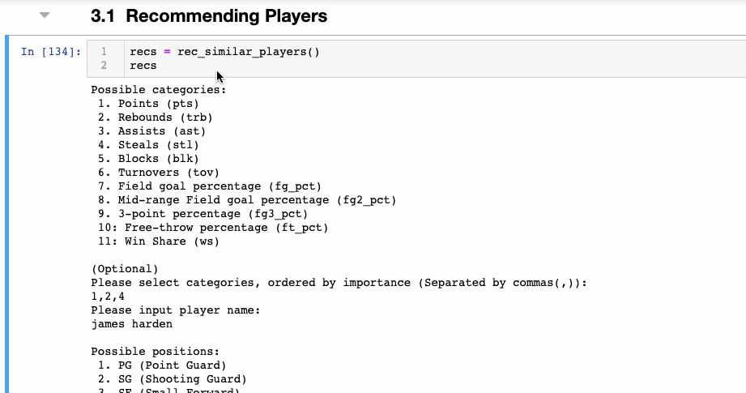

# Ball_is_lyfe
Ever get snubbed during your fantasy basketball draft? This should help.

## Link to [Presentation Slides](https://docs.google.com/presentation/d/1s-w3XqQz9OUMAo-ClbzcDG1MEG1sxAI4TVwj9c9ffLo/edit?usp=sharing)

## Goals
Predict individual player fantasy performance for upcoming year
Recommend players to draft given a desired, but unavaialable player

## Data Sources
basketball-reference.com (for all player stats)
yahoo.com (for fantasy points system)

## Some EDA
Link to [EDA Notebook](final_df_eda.ipynb)

No. of seasons: 40 seasons (1980 - 2019)

No. of unique players: 2349

#### Which performance metric should be target variable to predict fantasy basketball performance?
Win Shares

#### How many players are in each position?

#### Shooting has become more essential 
The NBA has recently been changing its game to be more 3-point heavy, thanks to Steph Curry. Since the 2014-15 season (Steph’s first MVP season), 3-point % has seen an incredible increase, especially in big-men: Power Forwards and Centers

##### Prior to 2014-15: 

PF 3P% = 19.09%

C 3P% = 9.22%

##### 2018-19:

PF 3P% = 31.12%

C 3P% = 18.63%

## Models

#### The Linear Regression Model
##### Results:

Lambda (or scikit learn alpha) = 0

Sum of squared error on training set = 45497.6182

Sum of squared error on test set = 10619.9286

Training R-squared = 0.5533

Test R-squared = 0.5451

Training Mean Squared Error = 4.7374

Test Mean Squared Error = 4.4231

#### The Ridge Regression Model
##### Results:

Lambda (or scikit learn alpha) = 2

Sum of squared error on training set = 45498.8919

Sum of squared error on test set = 10620.6587

Training R-squared = 0.5533

Test R-squared = 0.5451

Training Mean Squared Error = 4.7375

Test Mean Squared Error = 4.4234

##### Used Ridge regression to predict future win-shares

## Recommender System in Action

